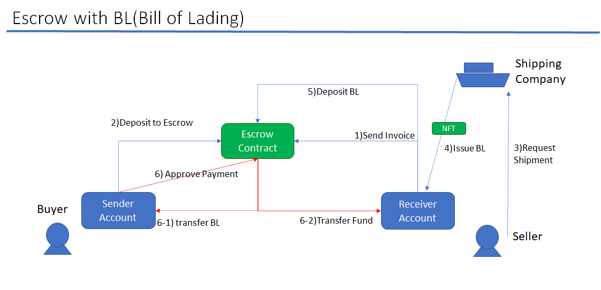

# Escrow System for Trade Finance

This project demonstrates PoC(Proof of Concept) of Escrow System for Trading Finance
Analyze the escrow scenarios and implement the necessary logic with its validation into smart contract.
This escrow system PoC addresses following features, which were challenging part for existing escrow business.   

- If buyer and seller cooperate, escrow agent cannot move the fund at all. So, Escrow Agent can be trust less for buyer and seller.
- Swap BL(proof of ownership) and fund simultaneously between buyer and seller whey they agree. 

##TODO
- This is just smart contract part. UI should be developed separately.
- code improvement (smart contract)
  - one contract can manage more than one active deal.(Currently only one)
  - Factory should be able to create both EscrowContract and EnhancedEscrowContract. (At the moment, file size issue when deploying.)
